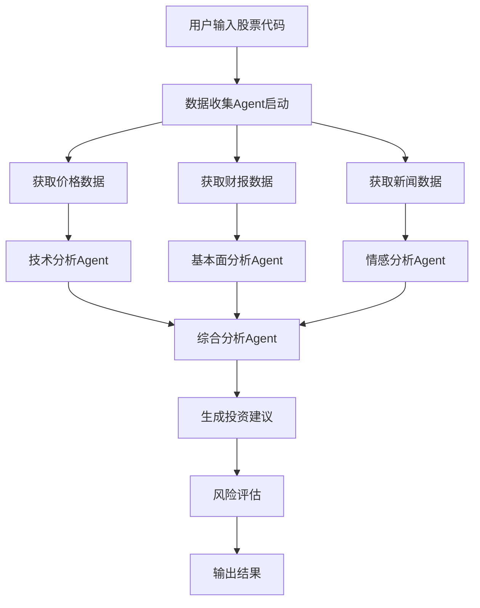

# InvestAI V1.0 产品规格说明书

## 目录
1. [产品概述](#1-产品概述)
2. [用户故事与需求](#2-用户故事与需求)
3. [系统架构设计](#3-系统架构设计)
4. [核心功能模块](#4-核心功能模块)
5. [API设计规范](#5-api设计规范)
6. [数据模型设计](#6-数据模型设计)
7. [部署架构](#7-部署架构)
8. [开发计划](#8-开发计划)

---

## 1. 产品概述

### 1.1 产品定位
InvestAI是一个基于Agent架构的智能股票投资分析平台，为个人投资者提供AI驱动的投资决策支持。

### 1.2 核心特性
- **多Agent协作**：分析、策略、监控、执行四大Agent类型
- **可解释AI**：每个投资建议都有详细的分析过程
- **实时数据**：集成多个数据源，提供实时市场信息
- **个性化配置**：根据用户风险偏好调整策略
- **开源透明**：核心算法开源，用户可审查和贡献

### 1.3 技术栈
- **后端**：Python + FastAPI + PostgreSQL + Redis
- **AI框架**：LangChain + OpenAI/Claude API + 本地模型
- **前端**：React + TypeScript + Tailwind CSS
- **数据处理**：Apache Kafka + ClickHouse
- **部署**：Docker + Kubernetes + Terraform

---

## 2. 用户故事与需求

### 2.1 目标用户画像

#### 主要用户：个人投资者 "小张"
- **背景**：30岁软件工程师，有100万资产
- **痛点**：工作忙碌，缺乏专业投资知识，容易被情绪影响
- **需求**：希望有AI助手帮助分析股票，给出理性建议
- **使用场景**：每天晚上查看投资建议，周末深度分析

#### 次要用户：投资顾问 "王经理"
- **背景**：小型投资公司投资顾问，管理50个客户
- **痛点**：需要为多个客户提供个性化建议，工作量大
- **需求**：希望有工具辅助分析，提高工作效率
- **使用场景**：为客户准备投资报告和建议

### 2.2 用户故事
```
作为个人投资者，
我希望能够输入我感兴趣的股票代码，
以便获得AI分析的投资建议和风险提示。

作为有经验的投资者，
我希望能够查看AI的分析过程和数据来源，
以便验证建议的合理性。

作为风险厌恶型投资者，
我希望能够设置我的风险偏好，
以便获得符合我投资风格的建议。

作为忙碌的上班族，
我希望能够设置股票监控和预警，
以便在重要变化时及时获得通知。
```

---

## 3. 系统架构设计

### 3.1 整体架构图
```
┌─────────────────────────────────────────────────────────┐
│                    用户接口层                            │
│  Web App  │  Mobile App  │  API Gateway  │  Admin Panel │
├─────────────────────────────────────────────────────────┤
│                    业务逻辑层                            │
│  用户服务  │  Agent编排  │  策略引擎  │  通知服务        │
├─────────────────────────────────────────────────────────┤
│                   Agent执行层                           │
│ 数据Agent │ 分析Agent │ 策略Agent │ 监控Agent │ 执行Agent │
├─────────────────────────────────────────────────────────┤
│                    AI能力层                             │
│    LLM服务   │   向量检索   │   知识图谱   │   推理引擎    │
├─────────────────────────────────────────────────────────┤
│                    数据存储层                            │
│  PostgreSQL  │   Redis    │  ClickHouse  │  Vector DB  │
├─────────────────────────────────────────────────────────┤
│                    数据接入层                            │
│  股票数据API │ 财报数据  │  新闻数据  │  宏观经济数据     │
└─────────────────────────────────────────────────────────┘
```

### 3.2 Agent架构设计

#### 3.2.1 Agent基础框架
```python
from abc import ABC, abstractmethod
from typing import Dict, List, Any
from dataclasses import dataclass

@dataclass
class AgentTask:
    task_id: str
    task_type: str
    input_data: Dict[str, Any]
    priority: int = 1
    timeout: int = 300

@dataclass
class AgentResult:
    task_id: str
    success: bool
    data: Dict[str, Any]
    error_msg: str = None
    execution_time: float = 0

class BaseAgent(ABC):
    def __init__(self, name: str, config: Dict):
        self.name = name
        self.config = config
        self.llm = self._init_llm()
        self.tools = self._init_tools()
    
    @abstractmethod
    async def execute(self, task: AgentTask) -> AgentResult:
        pass
    
    @abstractmethod
    def _init_tools(self) -> List:
        pass
```

#### 3.2.2 核心Agent实现
```python
# 数据收集Agent
class DataCollectionAgent(BaseAgent):
    async def execute(self, task: AgentTask) -> AgentResult:
        stock_code = task.input_data.get('stock_code')
        data_types = task.input_data.get('data_types', ['price', 'financial', 'news'])
        
        result_data = {}
        for data_type in data_types:
            if data_type == 'price':
                result_data['price_data'] = await self._fetch_price_data(stock_code)
            elif data_type == 'financial':
                result_data['financial_data'] = await self._fetch_financial_data(stock_code)
            elif data_type == 'news':
                result_data['news_data'] = await self._fetch_news_data(stock_code)
        
        return AgentResult(
            task_id=task.task_id,
            success=True,
            data=result_data
        )

# 基本面分析Agent
class FundamentalAnalysisAgent(BaseAgent):
    async def execute(self, task: AgentTask) -> AgentResult:
        financial_data = task.input_data.get('financial_data')
        
        # 使用LLM分析财务数据
        analysis_prompt = self._build_analysis_prompt(financial_data)
        analysis_result = await self.llm.apredict(analysis_prompt)
        
        # 计算关键财务指标
        ratios = self._calculate_financial_ratios(financial_data)
        
        return AgentResult(
            task_id=task.task_id,
            success=True,
            data={
                'analysis': analysis_result,
                'financial_ratios': ratios,
                'score': self._calculate_fundamental_score(ratios)
            }
        )
```

---

## 4. 核心功能模块

### 4.1 功能模块清单

#### 4.1.1 用户管理模块
- 用户注册/登录
- 用户配置管理
- 风险偏好设置
- 订阅计划管理

#### 4.1.2 股票分析模块
- 基本面分析
- 技术面分析
- 情感分析
- 综合评分

#### 4.1.3 投资策略模块
- 策略生成
- 策略回测
- 策略比较
- 个性化推荐

#### 4.1.4 监控预警模块
- 价格监控
- 事件监控
- 异常检测
- 通知推送

#### 4.1.5 报告生成模块
- 投资报告
- 风险分析
- 业绩追踪
- 数据可视化

### 4.2 详细功能设计

#### 4.2.1 股票分析流程


#### 4.2.2 分析Agent工作流
```python
class AnalysisOrchestrator:
    def __init__(self):
        self.agents = {
            'data_collector': DataCollectionAgent('data_collector', {}),
            'fundamental': FundamentalAnalysisAgent('fundamental', {}),
            'technical': TechnicalAnalysisAgent('technical', {}),
            'sentiment': SentimentAnalysisAgent('sentiment', {}),
            'risk': RiskAssessmentAgent('risk', {}),
            'strategy': StrategyGenerationAgent('strategy', {})
        }
    
    async def analyze_stock(self, stock_code: str, user_profile: dict) -> dict:
        # 1. 数据收集
        data_task = AgentTask(
            task_id=f"data_{stock_code}",
            task_type="data_collection",
            input_data={'stock_code': stock_code}
        )
        data_result = await self.agents['data_collector'].execute(data_task)
        
        # 2. 并行分析
        analysis_tasks = []
        
        # 基本面分析任务
        fundamental_task = AgentTask(
            task_id=f"fundamental_{stock_code}",
            task_type="fundamental_analysis",
            input_data=data_result.data
        )
        analysis_tasks.append(self.agents['fundamental'].execute(fundamental_task))
        
        # 技术面分析任务
        technical_task = AgentTask(
            task_id=f"technical_{stock_code}",
            task_type="technical_analysis", 
            input_data=data_result.data
        )
        analysis_tasks.append(self.agents['technical'].execute(technical_task))
        
        # 情感分析任务
        sentiment_task = AgentTask(
            task_id=f"sentiment_{stock_code}",
            task_type="sentiment_analysis",
            input_data=data_result.data
        )
        analysis_tasks.append(self.agents['sentiment'].execute(sentiment_task))
        
        # 等待所有分析完成
        analysis_results = await asyncio.gather(*analysis_tasks)
        
        # 3. 风险评估
        risk_task = AgentTask(
            task_id=f"risk_{stock_code}",
            task_type="risk_assessment",
            input_data={
                'analysis_results': analysis_results,
                'user_profile': user_profile
            }
        )
        risk_result = await self.agents['risk'].execute(risk_task)
        
        # 4. 策略生成
        strategy_task = AgentTask(
            task_id=f"strategy_{stock_code}",
            task_type="strategy_generation",
            input_data={
                'analysis_results': analysis_results,
                'risk_assessment': risk_result.data,
                'user_profile': user_profile
            }
        )
        strategy_result = await self.agents['strategy'].execute(strategy_task)
        
        return {
            'stock_code': stock_code,
            'analysis': {
                'fundamental': analysis_results[0].data,
                'technical': analysis_results[1].data,
                'sentiment': analysis_results[2].data
            },
            'risk_assessment': risk_result.data,
            'investment_strategy': strategy_result.data,
            'timestamp': datetime.now().isoformat()
        }
```

---

## 5. API设计规范

### 5.1 RESTful API设计

#### 5.1.1 基础规范
- **Base URL**: `https://api.investai.com/v1`
- **认证方式**: Bearer Token (JWT)
- **响应格式**: JSON
- **状态码**: 标准HTTP状态码

#### 5.1.2 API端点设计
```yaml
# 用户相关
POST   /auth/login              # 用户登录
POST   /auth/register           # 用户注册
GET    /auth/profile            # 获取用户信息
PUT    /auth/profile            # 更新用户信息

# 股票分析
POST   /analysis/stock          # 分析单只股票
GET    /analysis/stock/{code}   # 获取股票分析结果
POST   /analysis/portfolio      # 分析投资组合
GET    /analysis/history        # 获取分析历史

# 监控预警
POST   /alerts                  # 创建预警
GET    /alerts                  # 获取预警列表
PUT    /alerts/{id}             # 更新预警
DELETE /alerts/{id}             # 删除预警

# 策略管理
GET    /strategies              # 获取策略列表
POST   /strategies              # 创建自定义策略
GET    /strategies/{id}         # 获取策略详情
POST   /strategies/{id}/backtest # 策略回测

# 报告生成
POST   /reports/generate        # 生成报告
GET    /reports                 # 获取报告列表
GET    /reports/{id}            # 获取报告详情
```

#### 5.1.3 API响应格式
```json
{
  "success": true,
  "data": {
    "stock_code": "000001",
    "analysis": {
      "fundamental": {
        "score": 85,
        "pe_ratio": 12.5,
        "pb_ratio": 1.2,
        "roe": 15.8,
        "debt_ratio": 0.35,
        "analysis_text": "该公司基本面良好，盈利能力强..."
      },
      "technical": {
        "trend": "bullish",
        "support_level": 12.50,
        "resistance_level": 15.20,
        "rsi": 65,
        "macd_signal": "buy",
        "analysis_text": "技术面显示上涨趋势，建议关注..."
      },
      "sentiment": {
        "score": 72,
        "positive_ratio": 0.68,
        "neutral_ratio": 0.22,
        "negative_ratio": 0.10,
        "key_events": ["业绩预增", "新产品发布"]
      }
    },
    "investment_recommendation": {
      "action": "buy",
      "confidence": 0.75,
      "target_price": 14.80,
      "stop_loss": 11.20,
      "holding_period": "3-6月",
      "reasoning": "基于基本面分析..."
    },
    "risk_assessment": {
      "risk_level": "medium",
      "risk_factors": ["市场波动", "行业政策"],
      "risk_score": 45
    }
  },
  "message": "分析完成",
  "timestamp": "2024-01-15T10:30:00Z"
}
```

### 5.2 WebSocket API设计
```javascript
// 实时数据推送
const ws = new WebSocket('wss://api.investai.com/v1/ws');

// 订阅股票实时数据
ws.send(JSON.stringify({
  action: 'subscribe',
  type: 'stock_price',
  symbols: ['000001', '000002']
}));

// 订阅预警通知
ws.send(JSON.stringify({
  action: 'subscribe', 
  type: 'alerts',
  user_id: 'user123'
}));
```

---

## 6. 数据模型设计

### 6.1 核心数据模型

#### 6.1.1 用户模型
```sql
CREATE TABLE users (
    id UUID PRIMARY KEY DEFAULT gen_random_uuid(),
    username VARCHAR(50) UNIQUE NOT NULL,
    email VARCHAR(255) UNIQUE NOT NULL,
    password_hash VARCHAR(255) NOT NULL,
    full_name VARCHAR(100),
    phone VARCHAR(20),
    risk_profile JSONB DEFAULT '{}',
    subscription_plan VARCHAR(20) DEFAULT 'free',
    subscription_expires_at TIMESTAMP,
    created_at TIMESTAMP DEFAULT NOW(),
    updated_at TIMESTAMP DEFAULT NOW()
);
```

#### 6.1.2 股票数据模型
```sql
-- 股票基本信息
CREATE TABLE stocks (
    code VARCHAR(10) PRIMARY KEY,
    name VARCHAR(100) NOT NULL,
    market VARCHAR(20) NOT NULL,
    industry VARCHAR(50),
    sector VARCHAR(50),
    is_active BOOLEAN DEFAULT true,
    created_at TIMESTAMP DEFAULT NOW()
);

-- 股价数据
CREATE TABLE stock_prices (
    id BIGSERIAL PRIMARY KEY,
    stock_code VARCHAR(10) REFERENCES stocks(code),
    timestamp TIMESTAMP NOT NULL,
    open_price DECIMAL(10,2),
    high_price DECIMAL(10,2),
    low_price DECIMAL(10,2),
    close_price DECIMAL(10,2),
    volume BIGINT,
    adj_close_price DECIMAL(10,2),
    INDEX(stock_code, timestamp)
);

-- 财务数据
CREATE TABLE financial_reports (
    id UUID PRIMARY KEY DEFAULT gen_random_uuid(),
    stock_code VARCHAR(10) REFERENCES stocks(code),
    report_period DATE NOT NULL,
    report_type VARCHAR(20) NOT NULL, -- annual, quarterly
    revenue DECIMAL(15,2),
    net_income DECIMAL(15,2),
    total_assets DECIMAL(15,2),
    total_liabilities DECIMAL(15,2),
    shareholders_equity DECIMAL(15,2),
    operating_cash_flow DECIMAL(15,2),
    raw_data JSONB,
    created_at TIMESTAMP DEFAULT NOW()
);
```

#### 6.1.3 分析结果模型
```sql
-- 分析任务
CREATE TABLE analysis_tasks (
    id UUID PRIMARY KEY DEFAULT gen_random_uuid(),
    user_id UUID REFERENCES users(id),
    stock_code VARCHAR(10) REFERENCES stocks(code),
    task_type VARCHAR(50) NOT NULL,
    status VARCHAR(20) DEFAULT 'pending', -- pending, running, completed, failed
    input_params JSONB DEFAULT '{}',
    result JSONB DEFAULT '{}',
    error_message TEXT,
    execution_time_ms INTEGER,
    created_at TIMESTAMP DEFAULT NOW(),
    completed_at TIMESTAMP
);

-- 投资建议
CREATE TABLE investment_recommendations (
    id UUID PRIMARY KEY DEFAULT gen_random_uuid(),
    analysis_task_id UUID REFERENCES analysis_tasks(id),
    user_id UUID REFERENCES users(id),
    stock_code VARCHAR(10) REFERENCES stocks(code),
    recommendation VARCHAR(20) NOT NULL, -- buy, sell, hold
    confidence_score DECIMAL(3,2),
    target_price DECIMAL(10,2),
    stop_loss DECIMAL(10,2),
    reasoning TEXT,
    fundamental_score INTEGER,
    technical_score INTEGER,
    sentiment_score INTEGER,
    risk_score INTEGER,
    created_at TIMESTAMP DEFAULT NOW()
);
```

#### 6.1.4 监控预警模型
```sql
-- 用户预警设置
CREATE TABLE user_alerts (
    id UUID PRIMARY KEY DEFAULT gen_random_uuid(),
    user_id UUID REFERENCES users(id),
    stock_code VARCHAR(10) REFERENCES stocks(code),
    alert_type VARCHAR(30) NOT NULL, -- price, volume, news, technical
    condition_type VARCHAR(20) NOT NULL, -- above, below, change_percent
    threshold_value DECIMAL(15,4),
    is_active BOOLEAN DEFAULT true,
    notification_methods JSONB DEFAULT '["email"]', -- email, sms, push
    created_at TIMESTAMP DEFAULT NOW(),
    triggered_at TIMESTAMP
);

-- 预警触发记录
CREATE TABLE alert_triggers (
    id UUID PRIMARY KEY DEFAULT gen_random_uuid(),
    alert_id UUID REFERENCES user_alerts(id),
    trigger_value DECIMAL(15,4),
    trigger_time TIMESTAMP DEFAULT NOW(),
    notification_sent BOOLEAN DEFAULT false,
    notification_details JSONB DEFAULT '{}'
);
```

### 6.2 时序数据设计 (ClickHouse)
```sql
-- 股价时序数据
CREATE TABLE stock_price_ts (
    stock_code String,
    timestamp DateTime,
    open Float64,
    high Float64,
    low Float64,
    close Float64,
    volume UInt64,
    adj_close Float64
) ENGINE = MergeTree()
PARTITION BY toYYYYMM(timestamp)
ORDER BY (stock_code, timestamp);

-- 分析指标时序数据  
CREATE TABLE analysis_metrics_ts (
    stock_code String,
    timestamp DateTime,
    metric_name String,
    metric_value Float64,
    analysis_version String
) ENGINE = MergeTree()
PARTITION BY toYYYYMM(timestamp)
ORDER BY (stock_code, metric_name, timestamp);
```

---

## 7. 部署架构

### 7.1 本地开发环境
```yaml
# docker-compose.yml
version: '3.8'
services:
  # 应用服务
  app:
    build: .
    ports:
      - "8000:8000"
    environment:
      - DATABASE_URL=postgresql://user:pass@db:5432/investai
      - REDIS_URL=redis://redis:6379
    depends_on:
      - db
      - redis

  # 数据库
  db:
    image: postgres:15
    environment:
      POSTGRES_DB: investai
      POSTGRES_USER: user
      POSTGRES_PASSWORD: pass
    volumes:
      - postgres_data:/var/lib/postgresql/data

  # 缓存
  redis:
    image: redis:7-alpine
    ports:
      - "6379:6379"

  # 消息队列
  rabbitmq:
    image: rabbitmq:3-management-alpine
    ports:
      - "5672:5672"
      - "15672:15672"

  # 时序数据库
  clickhouse:
    image: clickhouse/clickhouse-server:latest
    ports:
      - "8123:8123"
      - "9000:9000"

volumes:
  postgres_data:
```

### 7.2 生产环境架构
```yaml
# kubernetes deployment
apiVersion: apps/v1
kind: Deployment
metadata:
  name: investai-api
spec:
  replicas: 3
  selector:
    matchLabels:
      app: investai-api
  template:
    metadata:
      labels:
        app: investai-api
    spec:
      containers:
      - name: api
        image: investai/api:v1.0.0
        ports:
        - containerPort: 8000
        env:
        - name: DATABASE_URL
          valueFrom:
            secretKeyRef:
              name: db-secret
              key: url
        - name: REDIS_URL
          valueFrom:
            configMapKeyRef:
              name: app-config
              key: redis-url
        resources:
          requests:
            cpu: 100m
            memory: 256Mi
          limits:
            cpu: 500m
            memory: 512Mi
```

### 7.3 CI/CD流水线
```yaml
# .github/workflows/deploy.yml
name: Deploy to Production
on:
  push:
    branches: [main]

jobs:
  test:
    runs-on: ubuntu-latest
    steps:
    - uses: actions/checkout@v2
    - name: Set up Python
      uses: actions/setup-python@v2
      with:
        python-version: 3.11
    - name: Install dependencies
      run: |
        pip install -r requirements.txt
        pip install -r requirements-test.txt
    - name: Run tests
      run: pytest tests/ -v --cov=app

  build:
    needs: test
    runs-on: ubuntu-latest
    steps:
    - uses: actions/checkout@v2
    - name: Build Docker image
      run: |
        docker build -t investai/api:${{ github.sha }} .
        docker tag investai/api:${{ github.sha }} investai/api:latest
    - name: Push to registry
      run: |
        docker push investai/api:${{ github.sha }}
        docker push investai/api:latest

  deploy:
    needs: build
    runs-on: ubuntu-latest
    steps:
    - name: Deploy to Kubernetes
      run: |
        kubectl set image deployment/investai-api api=investai/api:${{ github.sha }}
        kubectl rollout status deployment/investai-api
```

---

## 8. 开发计划

### 8.1 Sprint规划 (敏捷开发)

#### Sprint 1 (2周) - 基础架构
**目标**: 搭建基础开发环境和核心框架
- [ ] 项目结构设计
- [ ] 数据库schema设计
- [ ] 基础API框架搭建
- [ ] Docker开发环境配置
- [ ] 单元测试框架配置

#### Sprint 2 (2周) - 数据层开发
**目标**: 实现数据收集和存储功能
- [ ] 股票数据API集成
- [ ] 数据收集Agent开发
- [ ] 数据清洗和存储逻辑
- [ ] 数据质量监控
- [ ] API接口开发

#### Sprint 3 (3周) - 核心分析功能
**目标**: 实现基本面和技术面分析
- [ ] 基本面分析Agent
- [ ] 技术面分析Agent  
- [ ] LLM集成和提示工程
- [ ] 分析结果存储
- [ ] 分析API接口

#### Sprint 4 (2周) - 策略生成
**目标**: 实现投资建议生成
- [ ] 策略生成Agent
- [ ] 风险评估模块
- [ ] 个性化推荐算法
- [ ] 策略API接口
- [ ] 结果可视化

#### Sprint 5 (2周) - 前端界面
**目标**: 实现用户界面
- [ ] React前端框架搭建
- [ ] 用户认证界面
- [ ] 股票分析界面
- [ ] 结果展示界面
- [ ] 响应式设计

#### Sprint 6 (2周) - 监控预警
**目标**: 实现实时监控功能
- [ ] 监控Agent开发
- [ ] WebSocket实时推送
- [ ] 预警规则引擎
- [ ] 通知系统
- [ ] 预警管理界面

#### Sprint 7 (1周) - 集成测试
**目标**: 系统集成和测试
- [ ] 端到端测试
- [ ] 性能测试
- [ ] 安全测试
- [ ] 用户验收测试
- [ ] 文档完善

#### Sprint 8 (1周) - 部署上线
**目标**: 生产环境部署
- [ ] 生产环境配置
- [ ] CI/CD流水线
- [ ] 监控告警配置
- [ ] 灰度发布
- [ ] 正式上线

### 8.2 技术里程碑
- **M1**: 基础架构完成 (第4周)
- **M2**: 核心分析功能完成 (第9周)  
- **M3**: 完整产品功能完成 (第13周)
- **M4**: 生产环境部署完成 (第15周)

### 8.3 人力资源规划
| 角色 | 人数 | 主要职责 |
|------|------|----------|
| 技术负责人 | 1 | 架构设计、技术决策 |
| 后端开发 | 3 | API开发、Agent开发 |
| 前端开发 | 2 | UI界面、用户体验 |
| AI算法工程师 | 2 | 模型训练、提示工程 |
| 测试工程师 | 1 | 测试设计、质量保证 |
| DevOps工程师 | 1 | 部署运维、监控 |

### 8.4 风险控制
- **技术风险**: 每周技术评审，及时发现问题
- **进度风险**: 每日站会，敏捷迭代调整
- **质量风险**: 代码审查、自动化测试
- **集成风险**: 持续集成、早期集成验证

---

## 结论

InvestAI V1.0产品设计基于现代软件架构最佳实践，采用Agent协作模式实现智能投资分析。通过分阶段开发和敏捷迭代，我们能够在15周内交付一个功能完整、性能稳定的MVP产品。

**成功关键因素:**
1. **技术架构**: 微服务+Agent架构保证系统扩展性
2. **AI能力**: LLM+专业知识结合提供准确分析
3. **用户体验**: 简洁直观的界面设计
4. **数据质量**: 多源数据集成和质量保证
5. **团队执行**: 专业团队和敏捷开发流程

通过这个产品规格说明书，开发团队可以清晰地理解产品需求、技术实现路径和开发计划，为项目的成功实施奠定坚实基础。