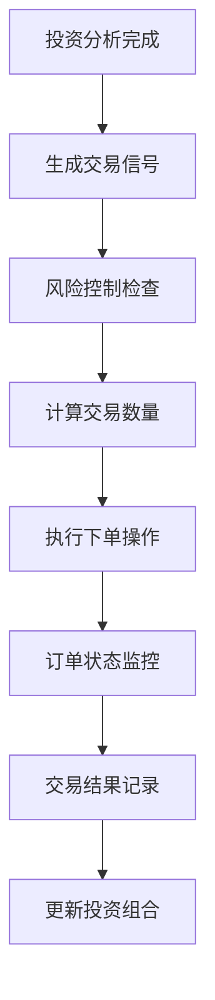
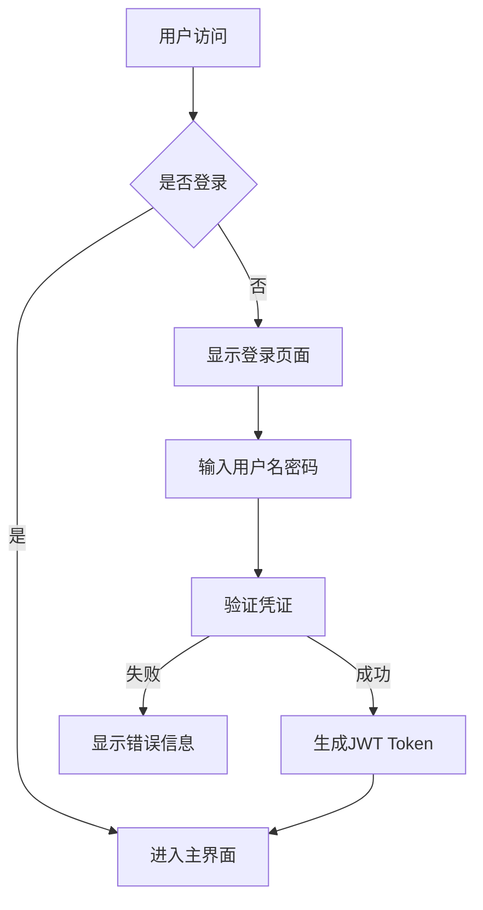
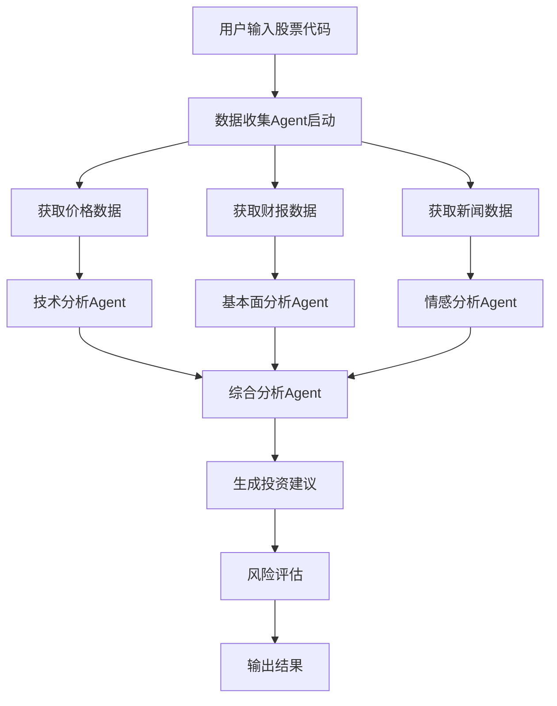

# InvestAI V1.0 技术设计文档

## 1. 项目概述

### 1.1 项目背景
InvestAI是一个基于Agent架构的智能股票投资分析平台，为个人投资者提供AI驱动的投资决策支持。项目采用开源+SaaS混合商业模式，目标是为2.12亿中国股民提供专业的投资分析工具。

### 1.2 核心价值
- **智能分析**: 多维度AI驱动的投资分析
- **个性化策略**: 基于用户风险偏好的定制化投资建议
- **透明决策**: 完整的分析过程可追溯和解释
- **持续学习**: 基于市场变化和用户反馈不断优化

### 1.3 技术愿景
构建一个可扩展、高性能、安全的AI投资分析平台，支持从基础分析到高级策略的全方位投资支持。

## 2. 系统架构

### 2.1 整体架构图
```
┌─────────────────────────────────────────────────────────┐
│                    用户接口层                            │
│  Web App  │  Mobile App  │  API Gateway  │  Admin Panel │
├─────────────────────────────────────────────────────────┤
│                    业务逻辑层                            │
│  用户服务  │  Agent编排  │  策略引擎  │  通知服务        │
├─────────────────────────────────────────────────────────┤
│                   Agent执行层                           │
│ 数据Agent │ 分析Agent │ 策略Agent │ 监控Agent │ 执行Agent │
├─────────────────────────────────────────────────────────┤
│                    AI能力层                             │
│    LLM服务   │   向量检索   │   知识图谱   │   推理引擎    │
├─────────────────────────────────────────────────────────┤
│                    数据存储层                            │
│  PostgreSQL  │   Redis    │  ClickHouse  │  Vector DB  │
├─────────────────────────────────────────────────────────┤
│                    数据接入层                            │
│  股票数据API │ 财报数据  │  新闻数据  │  宏观经济数据     │
└─────────────────────────────────────────────────────────┘
```

### 2.2 技术栈选择

#### 后端技术栈
- **框架**: Python + FastAPI (高性能异步框架)
- **数据库**: PostgreSQL (关系型数据) + Redis (缓存)
- **时序数据库**: ClickHouse (高性能时序数据分析)
- **向量数据库**: Pinecone/Weaviate (AI向量检索)
- **消息队列**: RabbitMQ/Kafka (异步任务处理)

#### AI技术栈
- **LLM框架**: LangChain + OpenAI/Claude API
- **本地模型**: 微调的开源模型 (Llama 2, ChatGLM)
- **向量检索**: Sentence Transformers + FAISS
- **知识图谱**: Neo4j/JanusGraph

#### 前端技术栈
- **框架**: React + TypeScript
- **UI库**: Ant Design + Tailwind CSS
- **状态管理**: Redux Toolkit + React Query
- **可视化**: ECharts + D3.js

#### 基础设施
- **容器化**: Docker + Docker Compose
- **编排**: Kubernetes (生产环境)
- **CI/CD**: GitHub Actions + ArgoCD
- **监控**: Prometheus + Grafana + ELK
- **日志**: Loki + Tempo

## 3. 核心组件设计

### 3.1 Agent架构设计

#### 3.1.3 交易执行Agent (FutuTradingContext)
基于富途牛牛开放平台官方最佳实践实现的交易执行能力：

**核心功能**:
- **订单管理**: 下单、撤单、改单、查询订单状态
- **持仓管理**: 实时持仓查询和监控
- **账户管理**: 资金查询、账户信息获取
- **风险控制**: 基于用户风险偏好的仓位控制
- **交易执行**: 自动化执行投资建议

**支持的交易市场**:
- 港股市场 (TrdMarket.HK)
- 美股市场 (TrdMarket.US) 
- A股市场 (TrdMarket.CN)
- 期货市场 (TrdMarket.FUTURES)

**订单类型支持**:
- 市价单 (OrderType.MARKET)
- 限价单 (OrderType.LIMIT) 
- 止损单 (OrderType.STOP)
- 止损限价单 (OrderType.STOP_LIMIT)

**集成方式**:
```python
# 创建交易上下文（遵循官方API设计）
trd_ctx = FutuTradingContext(host="127.0.0.1", port=11111)

# 打开连接
if await trd_ctx.open():
    # 解锁交易
    await trd_ctx.unlock_trade("your_password")
    
    # 执行下单（官方参数顺序）
    response = await trd_ctx.place_order(
        price=320.0,
        qty=100,
        code="HK.00700",
        trd_side=TrdSide.BUY,
        order_type=OrderType.LIMIT,
        trd_env=TrdEnv.SIMULATE,
        remark="InvestAI策略"
    )
```

#### 3.1.1 Agent基础框架
```python
from abc import ABC, abstractmethod
from typing import Dict, List, Any
from dataclasses import dataclass

@dataclass
class AgentTask:
    task_id: str
    task_type: str
    input_data: Dict[str, Any]
    priority: int = 1
    timeout: int = 300

@dataclass  
class AgentResult:
    task_id: str
    success: bool
    data: Dict[str, Any]
    error_msg: str = None
    execution_time: float = 0

class BaseAgent(ABC):
    def __init__(self, name: str, config: Dict):
        self.name = name
        self.config = config
        self.llm = self._init_llm()
        self.tools = self._init_tools()
    
    @abstractmethod
    async def execute(self, task: AgentTask) -> AgentResult:
        pass
    
    @abstractmethod
    def _init_tools(self) -> List:
        pass
```

#### 3.1.2 核心Agent类型

1. **数据收集Agent (DataCollectionAgent)**
   - 多源数据获取和清洗
   - 数据质量验证和标准化
   - 缓存管理和数据更新策略

2. **基本面分析Agent (FundamentalAnalysisAgent)** 
   - 财务数据分析 (P/E, P/B, ROE, 债务比率等)
   - 估值模型计算 (DCF, 相对估值)
   - 财务健康度评估

3. **技术分析Agent (TechnicalAnalysisAgent)**
   - 技术指标计算 (RSI, MACD, 移动平均线等)
   - 图表模式识别
   - 趋势分析和支撑阻力位识别

4. **情感分析Agent (SentimentAnalysisAgent)**
   - 新闻舆情分析
   - 社交媒体情感挖掘
   - 市场情绪指数计算

5. **风险评估Agent (RiskAssessmentAgent)**
   - 风险度量 (VaR, 波动率等)
   - 风险因子分析
   - 投资组合风险控制

6. **策略生成Agent (StrategyGenerationAgent)**
   - 投资建议生成
   - 个性化策略定制
   - 目标价格和止损计算

7. **监控预警Agent (MonitoringAgent)**
   - 实时价格监控
   - 事件触发预警
   - 通知推送管理

### 3.2 数据模型设计

#### 3.2.1 核心数据表

**用户表 (users)**
```sql
CREATE TABLE users (
    id UUID PRIMARY KEY DEFAULT gen_random_uuid(),
    username VARCHAR(50) UNIQUE NOT NULL,
    email VARCHAR(255) UNIQUE NOT NULL,
    password_hash VARCHAR(255) NOT NULL,
    full_name VARCHAR(100),
    phone VARCHAR(20),
    risk_profile JSONB DEFAULT '{}',
    subscription_plan VARCHAR(20) DEFAULT 'free',
    subscription_expires_at TIMESTAMP,
    created_at TIMESTAMP DEFAULT NOW(),
    updated_at TIMESTAMP DEFAULT NOW()
);
```

**股票基本信息表 (stocks)**
```sql
CREATE TABLE stocks (
    code VARCHAR(10) PRIMARY KEY,
    name VARCHAR(100) NOT NULL,
    market VARCHAR(20) NOT NULL,
    industry VARCHAR(50),
    sector VARCHAR(50),
    is_active BOOLEAN DEFAULT true,
    created_at TIMESTAMP DEFAULT NOW()
);
```

**分析任务表 (analysis_tasks)**
```sql
CREATE TABLE analysis_tasks (
    id UUID PRIMARY KEY DEFAULT gen_random_uuid(),
    user_id UUID REFERENCES users(id),
    stock_code VARCHAR(10) REFERENCES stocks(code),
    task_type VARCHAR(50) NOT NULL,
    status VARCHAR(20) DEFAULT 'pending',
    input_params JSONB DEFAULT '{}',
    result JSONB DEFAULT '{}',
    error_message TEXT,
    execution_time_ms INTEGER,
    created_at TIMESTAMP DEFAULT NOW(),
    completed_at TIMESTAMP
);
```

#### 3.2.2 时序数据设计 (ClickHouse)

```sql
-- 股价时序数据
CREATE TABLE stock_price_ts (
    stock_code String,
    timestamp DateTime,
    open Float64,
    high Float64,
    low Float64,
    close Float64,
    volume UInt64,
    adj_close Float64
) ENGINE = MergeTree()
PARTITION BY toYYYYMM(timestamp)
ORDER BY (stock_code, timestamp);
```

### 3.3 API设计

#### 3.3.1 RESTful API规范

**基础信息**
- **Base URL**: `https://api.investai.com/v1`
- **认证方式**: Bearer Token (JWT)
- **响应格式**: JSON
- **版本控制**: URL路径版本控制

**核心API端点**

```yaml
# 认证相关
POST   /auth/login              # 用户登录
POST   /auth/register           # 用户注册
GET    /auth/profile            # 获取用户信息
PUT    /auth/profile            # 更新用户信息

# 股票分析
POST   /analysis/stock          # 分析单只股票
GET    /analysis/stock/{code}   # 获取股票分析结果
POST   /analysis/portfolio      # 分析投资组合
GET    /analysis/history        # 获取分析历史

# 监控预警
POST   /alerts                  # 创建预警
GET    /alerts                  # 获取预警列表
PUT    /alerts/{id}             # 更新预警
DELETE /alerts/{id}             # 删除预警

# 策略管理
GET    /strategies              # 获取策略列表
POST   /strategies              # 创建自定义策略
GET    /strategies/{id}         # 获取策略详情
POST   /strategies/{id}/backtest # 策略回测
```

#### 3.3.2 WebSocket实时API

```javascript
// 实时数据订阅
const ws = new WebSocket('wss://api.investai.com/v1/ws');

// 订阅股票价格
ws.send(JSON.stringify({
  action: 'subscribe',
  type: 'stock_price',
  symbols: ['000001', '000002']
}));

// 订阅预警通知
ws.send(JSON.stringify({
  action: 'subscribe', 
  type: 'alerts',
  user_id: 'user123'
}));
```

## 4. 富途交易API集成详细设计

### 4.1 交易API架构

#### 4.1.1 连接管理
```python
class FutuTradingClient:
    """富途交易客户端，负责与OpenD网关通信"""
    
    async def connect(self):
        """连接到富途OpenD网关"""
        
    async def place_order(self, order_req: OrderRequest) -> OrderResponse:
        """执行下单操作"""
        
    async def cancel_order(self, order_id: str, market: TrdMarket) -> OrderResponse:
        """撤销订单"""
        
    async def get_order_status(self, order_id: str, market: TrdMarket) -> Dict:
        """查询订单状态"""
        
    async def get_positions(self, market: TrdMarket) -> List[Position]:
        """获取持仓信息"""
        
    async def get_account_info(self) -> Optional[AccountInfo]:
        """获取账户资金信息"""
```

#### 4.1.2 数据模型
```python
# 交易市场枚举
class TrdMarket(Enum):
    HK = 1  # 港股
    US = 2  # 美股
    CN = 3  # A股
    FUTURES = 4  # 期货

# 订单类型枚举
class OrderType(Enum):
    NORMAL = 0  # 普通订单
    MARKET = 1  # 市价订单
    LIMIT = 2   # 限价订单

# 交易方向枚举
class TrdSide(Enum):
    BUY = 1  # 买入
    SELL = 2  # 卖出
```

### 4.2 交易执行流程

#### 4.2.1 自动化交易流程


#### 4.2.2 风险控制机制
- **仓位控制**: 根据用户风险偏好限制单笔投资金额
- **最大持仓**: 限制单个股票的最大持仓比例
- **止损机制**: 自动止损和止盈设置
- **交易频率限制**: 防止过度交易

### 4.3 API端点设计

#### 4.3.1 交易相关API
```yaml
# 订单管理
POST   /api/v1/trade/order          # 下单
POST   /api/v1/trade/cancel         # 撤单
GET    /api/v1/trade/order_status   # 查询订单状态
GET    /api/v1/trade/orders         # 获取订单列表

# 持仓管理  
GET    /api/v1/trade/positions      # 获取持仓列表
GET    /api/v1/trade/position/{id}  # 获取特定持仓

# 账户管理
GET    /api/v1/trade/account        # 获取账户信息
GET    /api/v1/trade/balance        # 获取资金余额

# 交易执行
POST   /api/v1/trade/execute        # 执行交易策略
```

#### 4.3.2 请求响应格式
```json
// 下单请求
{
  "symbol": "00700",
  "market": 1,
  "side": 1,
  "order_type": 2,
  "quantity": 100,
  "price": 320.0,
  "env": 1
}

// 下单响应
{
  "success": true,
  "order_id": "ORD_123456789",
  "timestamp": "2024-01-15T10:30:00Z"
}
```

## 5. 功能模块详细设计

### 4.1 用户管理模块

#### 4.1.1 用户认证流程


#### 4.1.2 风险偏好配置
- **风险等级**: conservative(保守), moderate(稳健), aggressive(激进)
- **投资期限**: short_term(短期), medium_term(中期), long_term(长期)
- **投资经验**: beginner(新手), intermediate(中级), advanced(高级)

### 4.2 股票分析模块

#### 4.2.1 分析流程


#### 4.2.2 分析指标

**基本面指标**
- 估值指标: P/E, P/B, P/S, EV/EBITDA
- 盈利能力: ROE, ROA, 毛利率, 净利率
- 财务健康: 债务比率, 流动比率, 速动比率
- 成长性: 营收增长率, 利润增长率

**技术指标**
- 趋势指标: MA, EMA, MACD
- 动量指标: RSI, Stochastic, CCI
- 波动率指标: ATR, Bollinger Bands
- 成交量指标: OBV, Volume MA

### 4.3 监控预警模块

#### 4.3.1 预警规则类型
1. **价格预警**: 价格突破特定阈值
2. **技术指标预警**: RSI超买超卖, MACD金叉死叉
3. **成交量预警**: 异常成交量变化
4. **新闻事件预警**: 重要新闻发布
5. **财务指标预警**: 财报数据异常

#### 4.3.2 通知方式
- **邮件通知**: HTML格式的投资报告
- **短信通知**: 关键预警信息
- **推送通知**: 移动端实时推送
- **WebSocket**: 网页实时更新

## 5. 部署架构

### 5.1 开发环境部署

```yaml
# docker-compose.yml
version: '3.8'
services:
  # 应用服务
  app:
    build: .
    ports:
      - "8000:8000"
    environment:
      - DATABASE_URL=postgresql://user:pass@db:5432/investai
      - REDIS_URL=redis://redis:6379
    depends_on:
      - db
      - redis

  # 数据库
  db:
    image: postgres:15
    environment:
      POSTGRES_DB: investai
      POSTGRES_USER: user
      POSTGRES_PASSWORD: pass
    volumes:
      - postgres_data:/var/lib/postgresql/data

  # 缓存
  redis:
    image: redis:7-alpine
    ports:
      - "6379:6379"

  # 消息队列
  rabbitmq:
    image: rabbitmq:3-management-alpine
    ports:
      - "5672:5672"
      - "15672:15672"

  # 时序数据库
  clickhouse:
    image: clickhouse/clickhouse-server:latest
    ports:
      - "8123:8123"
      - "9000:9000"

volumes:
  postgres_data:
```

### 5.2 生产环境架构

#### 5.2.1 Kubernetes部署
```yaml
apiVersion: apps/v1
kind: Deployment
metadata:
  name: investai-api
spec:
  replicas: 3
  selector:
    matchLabels:
      app: investai-api
  template:
    metadata:
      labels:
        app: investai-api
    spec:
      containers:
      - name: api
        image: investai/api:v1.0.0
        ports:
        - containerPort: 8000
        env:
        - name: DATABASE_URL
          valueFrom:
            secretKeyRef:
              name: db-secret
              key: url
        resources:
          requests:
            cpu: 100m
            memory: 256Mi
          limits:
            cpu: 500m
            memory: 512Mi
```

#### 5.2.2 监控告警配置
- **应用监控**: Prometheus metrics导出
- **日志收集**: Loki日志聚合
- **链路追踪**: Tempo分布式追踪
- **告警规则**: Alertmanager配置

### 5.3 CI/CD流水线

```yaml
# .github/workflows/deploy.yml
name: Deploy to Production
on:
  push:
    branches: [main]

jobs:
  test:
    runs-on: ubuntu-latest
    steps:
    - uses: actions/checkout@v2
    - name: Set up Python
      uses: actions/setup-python@v2
      with:
        python-version: 3.11
    - name: Install dependencies
      run: |
        pip install -r requirements.txt
        pip install -r requirements-test.txt
    - name: Run tests
      run: pytest tests/ -v --cov=app

  build:
    needs: test
    runs-on: ubuntu-latest
    steps:
    - uses: actions/checkout@v2
    - name: Build Docker image
      run: |
        docker build -t investai/api:${{ github.sha }} .
        docker tag investai/api:${{ github.sha }} investai/api:latest
    - name: Push to registry
      run: |
        docker push investai/api:${{ github.sha }}
        docker push investai/api:latest

  deploy:
    needs: build
    runs-on: ubuntu-latest
    steps:
    - name: Deploy to Kubernetes
      run: |
        kubectl set image deployment/investai-api api=investai/api:${{ github.sha }}
        kubectl rollout status deployment/investai-api
```

## 6. 安全设计

### 6.1 认证授权
- **JWT认证**: 基于Token的无状态认证
- **RBAC权限控制**: 基于角色的访问控制
- **API速率限制**: 防止API滥用
- **CORS配置**: 跨域资源共享安全配置

### 6.2 数据安全
- **数据加密**: TLS/SSL传输加密，数据库字段加密
- **敏感信息保护**: 密码哈希存储，API密钥安全管理
- **数据备份**: 定期数据备份和恢复测试
- **隐私合规**: GDPR、个人信息保护法合规

### 6.3 应用安全
- **输入验证**: 所有输入参数验证和清理
- **SQL注入防护**: ORM使用，参数化查询
- **XSS防护**: 输出编码，CSP策略
- **CSRF防护**: Token验证，SameSite Cookie

## 7. 性能优化

### 7.1 缓存策略
- **Redis缓存**: 热点数据缓存，分析结果缓存
- **CDN加速**: 静态资源CDN分发
- **浏览器缓存**: 合理的缓存头设置
- **数据库缓存**: 查询缓存，连接池优化

### 7.2 异步处理
- **Celery任务队列**: 耗时任务异步处理
- **WebSocket实时通信**: 实时数据推送
- **消息队列**: 解耦系统组件
- **批量处理**: 数据批量导入导出

### 7.3 数据库优化
- **索引优化**: 合理的索引设计
- **查询优化**: 避免N+1查询，使用JOIN优化
- **分库分表**: 数据量大的表水平拆分
- **读写分离**: 主从复制，读写分离

## 8. 开发计划

### 8.1 版本规划

#### V1.0 MVP (8周)
- ✅ 基础架构搭建
- ✅ 核心Agent框架
- ✅ 股票基本面分析
- ✅ 简单技术分析
- ✅ 基础用户界面
- ✅ API接口开发

#### V1.1 功能完善 (4周)
- 🔄 情感分析功能
- 🔄 风险评估模块
- 🔄 投资建议生成
- 🔄 监控预警功能
- 🔄 移动端适配

#### V1.2 性能优化 (2周)
- 🔄 缓存策略优化
- 🔄 数据库性能优化
- 🔄 前端性能优化
- 🔄 监控告警完善

### 8.2 团队分工

| 角色 | 人数 | 主要职责 |
|------|------|----------|
| 技术负责人 | 1 | 架构设计、技术决策 |
| 后端开发 | 3 | API开发、Agent开发 |
| 前端开发 | 2 | UI界面、用户体验 |
| AI算法工程师 | 2 | 模型训练、提示工程 |
| 测试工程师 | 1 | 测试设计、质量保证 |
| DevOps工程师 | 1 | 部署运维、监控 |

### 8.3 风险评估

#### 技术风险
- **AI模型准确性**: 多模型验证，人工监督机制
- **数据质量**: 多源数据验证，数据清洗流程
- **系统性能**: 压力测试，性能监控

#### 业务风险  
- **用户接受度**: 用户调研，快速迭代优化
- **竞争压力**: 差异化定位，技术壁垒构建
- **合规要求**: 法律顾问，合规团队建设

#### 应对措施
- 每周技术评审会议
- 自动化测试覆盖率要求
- 灰度发布和回滚机制
- 用户反馈快速响应机制

## 9. 附录

### 9.1 技术决策理由

**选择FastAPI的原因**
- 高性能异步框架，适合IO密集型应用
- 自动API文档生成，开发效率高
- 类型提示支持，代码质量高
- 活跃的社区和丰富的生态系统

**选择PostgreSQL的原因**
- 成熟的关系型数据库，功能丰富
- JSONB支持，灵活的数据模型
- 强大的扩展性和可靠性
- 完善的事务支持和数据一致性

**选择ClickHouse的原因**
- 专为时序数据设计，查询性能优异
- 列式存储，压缩比高
- 支持实时数据插入和查询
- 适合金融时间序列数据分析

### 9.2 性能指标目标

- **API响应时间**: < 200ms (P95)
- **系统可用性**: 99.9%
- **并发用户数**: 支持1000+并发用户
- **数据分析延迟**: < 5秒
- **数据更新频率**: 实时(价格)，每日(财务数据)

### 9.3 监控指标

- **应用性能**: QPS, 响应时间, 错误率
- **数据库性能**: 查询延迟, 连接数, 缓存命中率
- **系统资源**: CPU, 内存, 磁盘, 网络
- **业务指标**: 用户活跃度, 分析任务数, 预警触发数

---

**文档版本**: V1.0
**最后更新**: 2024-01-15
**负责人**: 技术团队